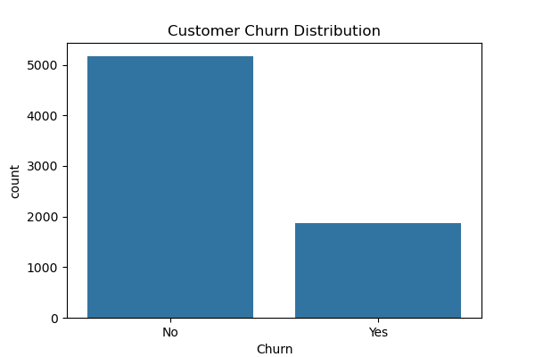
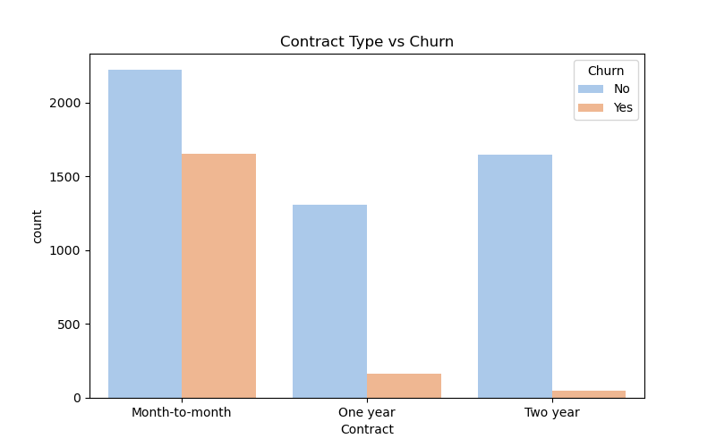
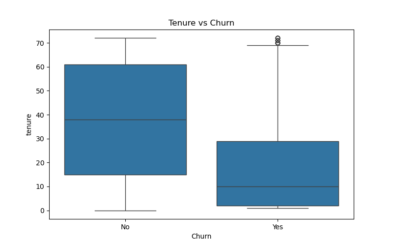
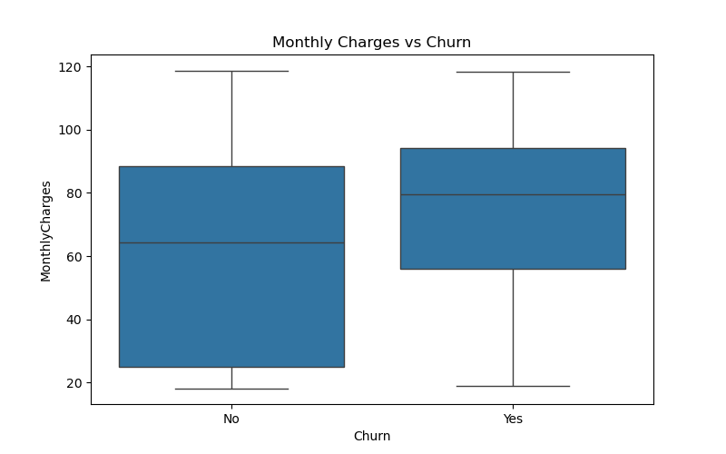
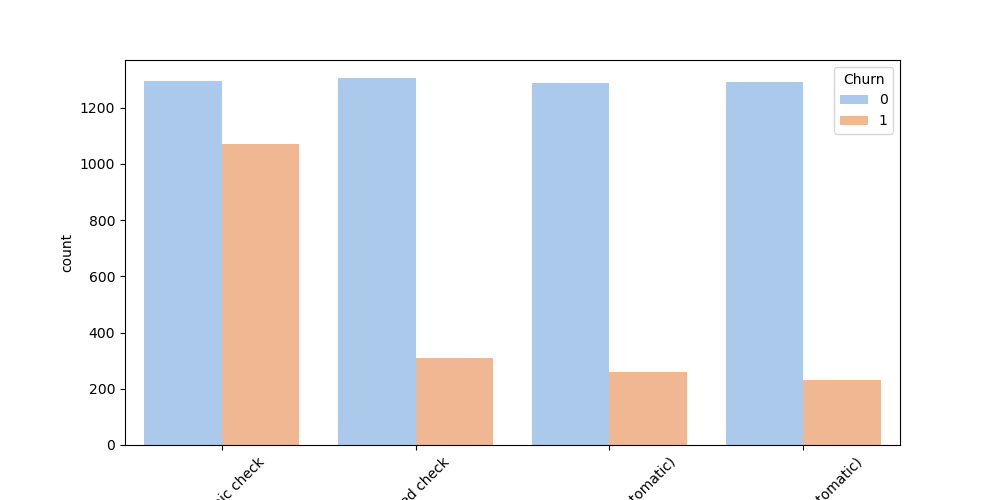
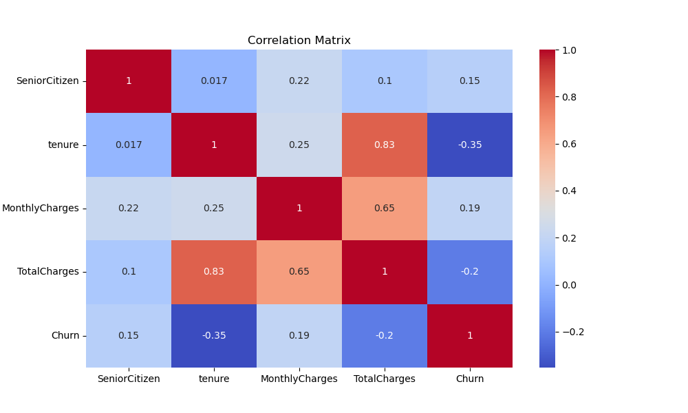

# Customer Churn Analysis

## Project Overview

Customer churn refers to customers who discontinue using a company's services. Understanding why customers leave is critical because retaining existing customers is generally more cost-effective than acquiring new ones.

This project analyzes customer churn patterns using the IBM Telco Customer Churn dataset and provides actionable business recommendations to improve customer retention.

---

## Objectives

* Explore customer churn behavior
* Identify factors associated with churn
* Visualize churn patterns
* Generate business insights
* Recommend customer retention strategies

---

## Dataset

Dataset Used: IBM Telco Customer Churn Dataset

The dataset contains customer information including:

* Gender
* Senior Citizen Status
* Partner Status
* Dependents
* Tenure
* Internet Service
* Contract Type
* Payment Method
* Monthly Charges
* Total Charges
* Churn Status

Target Variable:

* Churn (Yes / No)

---

## Tools and Technologies

* Python
* Pandas
* NumPy
* Matplotlib
* Seaborn
* JupyterLab

---

## Project Workflow

### 1. Data Loading

Loaded the customer churn dataset into a Pandas DataFrame.

### 2. Data Cleaning

* Checked missing values
* Removed unnecessary columns
* Converted data types where required

### 3. Exploratory Data Analysis (EDA)

Performed exploratory analysis to identify patterns and trends related to customer churn.

### 4. Visualization

Created visualizations to compare churn behavior across different customer segments.

### 5. Insights and Recommendations

Generated business recommendations based on analytical findings.

---

## Key Visualizations

### Customer Churn Distribution

### Contract Type vs Churn

### Tenure vs Churn

### Monthly Charges vs Churn

### Payment Method vs Count of churn

### Correlation Heatmap

---

## Key Findings

### 1. Contract Type Influences Churn

Customers on month-to-month contracts exhibit significantly higher churn rates compared to customers with longer-term contracts.

### 2. Customer Tenure Matters

Customers with shorter tenure are more likely to churn, indicating that new customers require additional engagement and support.

### 3. Monthly Charges Impact Retention

Customers with higher monthly charges tend to have higher churn rates.

### 4. Payment Method Patterns

Certain payment methods show elevated churn levels, suggesting possible customer experience concerns.

### 5. Long-Term Customers Are More Stable

Customers with longer relationships with the company are less likely to leave.

---

## Business Recommendations

### Improve Customer Onboarding

Provide targeted onboarding programs for new customers during their first six months.

### Promote Long-Term Contracts

Offer incentives and discounts for customers willing to switch from month-to-month plans to annual contracts.

### Review Pricing Strategy

Analyze pricing structures for customers with higher monthly charges.

### Strengthen Retention Campaigns

Develop personalized retention campaigns for customer segments exhibiting higher churn rates.

### Enhance Customer Experience

Investigate service quality and payment processes that may contribute to churn.

---

## Conclusion

The analysis identified contract type, tenure, monthly charges, and payment method as important factors associated with customer churn. These findings provide valuable insights that can help businesses design effective customer retention strategies and reduce customer attrition.

---

## Author

Swapnil

LinkedIn: 
